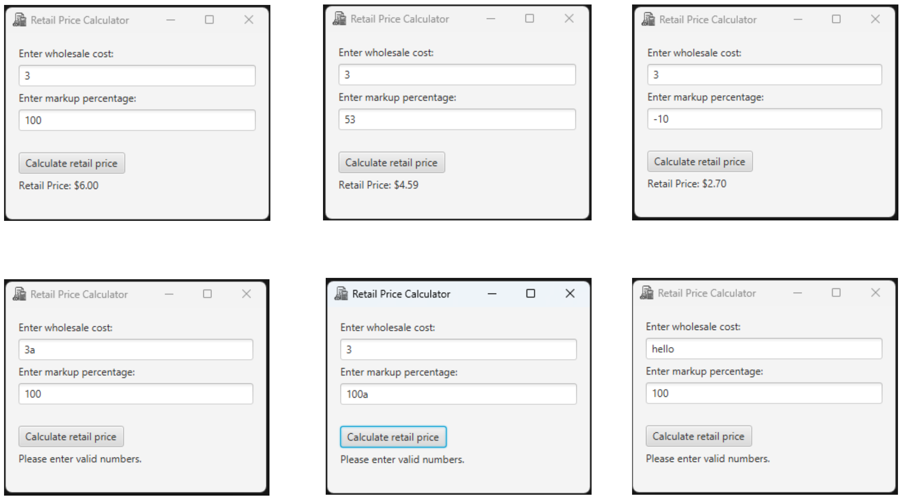

# Retail Price Calculator (JavaFX)

A simple JavaFX GUI application that calculates the retail price of an item based on its wholesale cost and markup percentage.

This project was developed for the **Object-Oriented Programming (CS 2477)** course at Lakehead University.

---

## Features

- Clean and user-friendly graphical interface
- GUI created programmatically in Java (no FXML)
- Accepts wholesale cost and markup percentage as user input
- Calculates retail price when the button is clicked
- Input validation using exception handling
- Output formatted to two decimal places
- Organized layout using JavaFX `VBox`

---

## Calculation Formula

Retail Price = Wholesale Cost + (Wholesale Cost × Markup Percentage ÷ 100)

---

## A Few Example Runs of the Program

